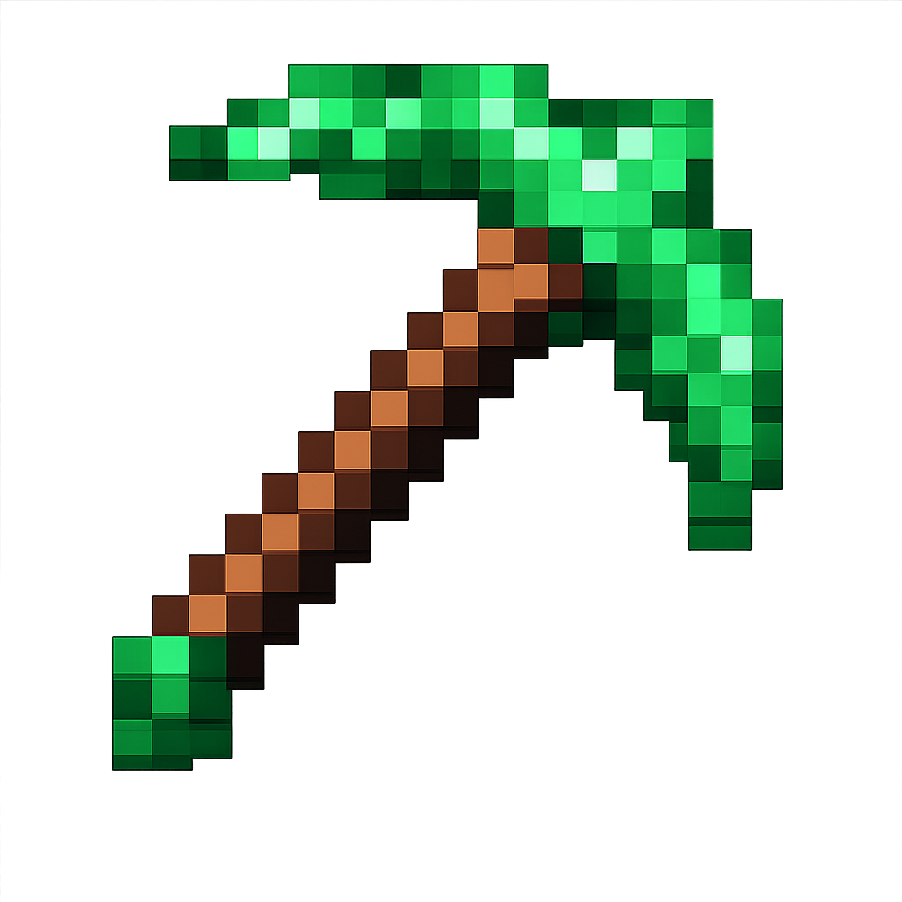

# Super Pickaxe Mod - Build & Installation Instructions



## What This Mod Does

This mod adds a **Super Pickaxe** to Minecraft that:
- Mines in a **3x3x3 area** instead of just one block
- Has the same durability and mining level as a **diamond pickaxe**
- Features a **bright green texture**
- Has a custom crafting recipe (3 cobblestone on top, 2 sticks below)
- Gives you torches as you mine (1 torch per 18 blocks mined)

## Download

**[Download superpickaxe-1.0.jar](build/libs/superpickaxe-1.0.jar)**

## Prerequisites

You need Java 17 installed on your Mac. Check with:
```bash
java -version
```

If you don't have Java 17, download it from: https://adoptium.net/

## How to Compile the Mod

1. Open Terminal and navigate to the mod directory:
   ```bash
   cd /Users/<user>/Desktop/Projects/minecraft/super-pickaxe
   ```

2. Build the mod using Gradle:
   ```bash
   ./gradlew build
   ```

   This will take several minutes the first time as it downloads dependencies.

3. Once complete, your mod JAR file will be located at:
   ```
   build/libs/superpickaxe-1.0.jar
   ```

## How to Install the Mod

### Step 1: Install Minecraft Forge

1. Go to https://files.minecraftforge.net/
2. Download **Forge 1.20.1** (version 47.2.0 or higher)
3. Run the installer and select "Install client"
4. Launch Minecraft and select the "forge" profile

### Step 2: Install Your Mod

1. Locate your Minecraft mods folder:
   - On Mac: `~/Library/Application Support/minecraft/mods`

2. If the `mods` folder doesn't exist, create it:
   ```bash
   mkdir -p ~/Library/Application\ Support/minecraft/mods
   ```

3. Copy your compiled mod to the mods folder:
   ```bash
   cp build/libs/superpickaxe-1.0.jar ~/Library/Application\ Support/minecraft/mods/
   ```

### Step 3: Enable and Use the Mod

1. Launch Minecraft
2. Select the **"forge"** profile from the launcher
3. Click "Play"
4. Once in-game, the mod is automatically enabled!

## How to Craft the Super Pickaxe

Open a crafting table and arrange:

```
[Cobblestone] [Stone] [Smooth Stone]
              [Stick]
              [Stick]
```

This requires cobblestone, stone, and smooth stone, making it progressively more expensive but worth the 3x3x3 mining power!

## Using the Super Pickaxe

- Equip the bright green Super Pickaxe
- Mine any block that a diamond pickaxe can mine
- It will automatically mine a 3x3x3 area (27 blocks total) around the block you mine
- Every 18 blocks you mine, you'll receive a torch automatically

## Troubleshooting

**Build fails?**
- Ensure Java 17 is installed
- Try: `./gradlew clean build`

**Mod doesn't appear in game?**
- Check you're using Forge 1.20.1
- Verify the JAR is in the correct mods folder
- Check logs at: `~/Library/Application Support/minecraft/logs/latest.log`

**Super Pickaxe has missing texture?**
- The texture should be bright green
- If it appears purple/black, rebuild the mod: `./gradlew clean build`

## Development

To modify the mod:

1. Edit the source files in `src/main/java/com/example/superpickaxe/`
2. Rebuild: `./gradlew build`
3. Copy the new JAR to the mods folder
4. Restart Minecraft

Key files:
- `SuperPickaxeItem.java` - The pickaxe logic and 3x3x3 mining
- `src/main/resources/data/superpickaxe/recipes/` - Crafting recipe
- `src/main/resources/assets/superpickaxe/textures/item/` - Bright green texture

Enjoy your new 3x3x3 mining pickaxe! 🟢⛏️
